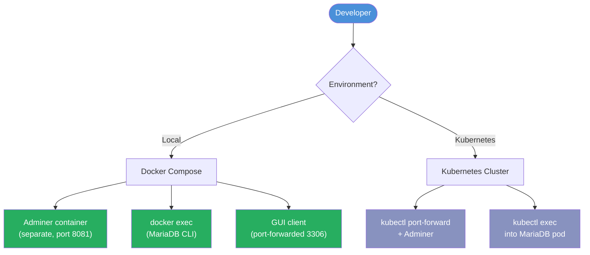
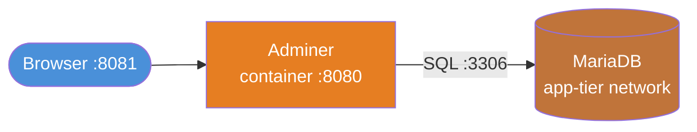

# Database & Admin Guide

> **Why is there no phpMinAdmin in this project?**
> The original `phpminiadmin.php` was removed during the security refactoring — it had hardcoded credentials, no authentication, and SQL injection vulnerabilities. It was publicly accessible through Nginx with no protection.
>
> This guide covers **safe alternatives** for database administration in both local development and Kubernetes environments.

---

## Table of Contents

1. [Overview](#overview)
2. [Local Development (Docker Compose)](#local-development-docker-compose)
   - [Option A — Adminer (Web UI)](#option-a--adminer-web-ui)
   - [Option B — MariaDB CLI](#option-b--mariadb-cli)
   - [Option C — GUI Client (TablePlus / DBeaver)](#option-c--gui-client-tableplus--dbeaver)
3. [Kubernetes](#kubernetes)
   - [Option A — kubectl port-forward + Adminer](#option-a--kubectl-port-forward--adminer)
   - [Option B — kubectl exec into the MariaDB Pod](#option-b--kubectl-exec-into-the-mariadb-pod)
4. [Common SQL Operations](#common-sql-operations)
5. [Security Rules](#security-rules)

---

## Overview

The database admin workflow follows a strict principle: **admin tooling must never be exposed through the public-facing Nginx service**. Instead, admin access is obtained by one of three methods depending on your environment:



> All admin sessions are **temporary** (containers/port-forwards are torn down after use) and **never** routed through the application's public port 8080.

---

## Local Development (Docker Compose)

Make sure the stack is running before connecting:

```bash
docker compose -f php-app-k8s-helm/docker-compose.yml ps
```

Your credentials are in `.env` (copied from `.env.example`). Defaults:

| Variable | Value |
|----------|-------|
| `MARIADB_ROOT_PASSWORD` | *(your root password)* |
| `MARIADB_USER` | `appuser` |
| `MARIADB_PASSWORD` | *(your app password)* |
| `MARIADB_DATABASE` | `appdb` |

---

### Option A — Adminer (Web UI)

[Adminer](https://www.adminer.org/) is a single-file PHP database manager. Run it as a **separate, ephemeral container** on the same Docker network as MariaDB.



**Start Adminer:**

```bash
docker run --rm \
  --name adminer-admin \
  --network php-app-k8s-helm_app-tier \
  -p 8081:8080 \
  adminer
```

**Open in browser:** [http://localhost:8081](http://localhost:8081)

**Login details:**

| Field | Value |
|-------|-------|
| System | `MySQL` |
| Server | `mariadb` |
| Username | `appuser` *(or `root`)* |
| Password | *(from your `.env`)* |
| Database | `appdb` |

**Stop Adminer when done** (the `--rm` flag removes the container automatically on exit):

```bash
docker stop adminer-admin
```

> Adminer is only reachable on port 8081 while the container is running. It is **not** part of the default `docker compose up` stack and must be started manually.

---

### Option B — MariaDB CLI

Connect directly to the MariaDB container with the `mariadb` command-line client — no extra software needed.

**As the application user:**

```bash
docker exec -it php-app-k8s-helm-mariadb-1 \
  mariadb -u appuser -p appdb
```

Enter the password from your `.env` (`MARIADB_PASSWORD`) when prompted.

**As root (for administrative tasks):**

```bash
docker exec -it php-app-k8s-helm-mariadb-1 \
  mariadb -u root -p
```

**Non-interactive (run a single query):**

```bash
docker exec php-app-k8s-helm-mariadb-1 \
  mariadb -u appuser -pYOUR_PASSWORD appdb \
  -e "SHOW TABLES;"
```

**Run a SQL file:**

```bash
docker exec -i php-app-k8s-helm-mariadb-1 \
  mariadb -u appuser -pYOUR_PASSWORD appdb \
  < /path/to/your/script.sql
```

---

### Option C — GUI Client (TablePlus / DBeaver)

Forward MariaDB's port to your localhost, then connect with any MySQL-compatible GUI.

**Find the MariaDB container IP (alternative: use port-forward):**

```bash
docker compose -f php-app-k8s-helm/docker-compose.yml \
  port mariadb 3306
```

If no host port is published, add a temporary port mapping or use `docker inspect`:

```bash
docker inspect php-app-k8s-helm-mariadb-1 \
  --format '{{range .NetworkSettings.Networks}}{{.IPAddress}}{{end}}'
```

**Connection settings for your GUI:**

| Field | Value |
|-------|-------|
| Host | `127.0.0.1` *(or the container IP)* |
| Port | `3306` |
| User | `appuser` |
| Password | *(from your `.env`)* |
| Database | `appdb` |

> To expose port 3306 on the host temporarily, add the following to the `mariadb` service in `docker-compose.yml`, then run `docker compose up -d mariadb`:
> ```yaml
> ports:
>   - "3306:3306"
> ```
> Remove the port mapping again after your admin session.

---

## Kubernetes

### Option A — kubectl port-forward + Adminer

This is the recommended method for Kubernetes. Port-forward the MariaDB service to your local machine and run Adminer locally.

**Step 1 — Find the MariaDB service name:**

```bash
kubectl get svc | grep mariadb
```

**Step 2 — Forward the port:**

```bash
kubectl port-forward svc/phpfpm-mariadb 3306:3306 &
```

**Step 3 — Run Adminer against your local port:**

```bash
docker run --rm \
  --name adminer-k8s \
  -p 8081:8080 \
  -e ADMINER_DEFAULT_SERVER=host.docker.internal \
  adminer
```

Open [http://localhost:8081](http://localhost:8081) and log in with the credentials from `helm-values-secret.yaml`.

**Step 4 — Clean up after your session:**

```bash
docker stop adminer-k8s
kill %1   # stop the port-forward background job
```

---

### Option B — kubectl exec into the MariaDB Pod

```bash
# Find the MariaDB pod name
kubectl get pods | grep mariadb

# Open a MariaDB shell
kubectl exec -it phpfpm-mariadb-0 -- \
  mariadb -u appuser -p appdb
```

**Run a SQL file from your local machine:**

```bash
kubectl exec -i phpfpm-mariadb-0 -- \
  mariadb -u appuser -pYOUR_PASSWORD appdb \
  < ./your-script.sql
```

---

## Common SQL Operations

These work in any of the connection methods above.

```sql
-- List all databases
SHOW DATABASES;

-- Select the app database
USE appdb;

-- List tables
SHOW TABLES;

-- Describe a table structure
DESCRIBE your_table;

-- Check database size
SELECT
  table_schema AS "Database",
  ROUND(SUM(data_length + index_length) / 1024 / 1024, 2) AS "Size (MB)"
FROM information_schema.TABLES
GROUP BY table_schema;

-- Create a table (example)
CREATE TABLE users (
  id          INT AUTO_INCREMENT PRIMARY KEY,
  username    VARCHAR(100) NOT NULL UNIQUE,
  email       VARCHAR(255) NOT NULL,
  created_at  TIMESTAMP DEFAULT CURRENT_TIMESTAMP
);

-- Show running processes
SHOW PROCESSLIST;

-- Check current user and host
SELECT USER(), @@hostname;
```

---

## Security Rules

| Rule | Reason |
|------|--------|
| Never add Adminer to the main `docker-compose.yml` | Prevents accidental public exposure |
| Never expose port 3306 permanently | Reduces attack surface |
| Always use `--rm` when running ephemeral admin containers | No leftover containers after sessions |
| Use `appuser` for app queries; `root` only for schema changes | Principle of least privilege |
| Never commit `.env` or `helm-values-secret.yaml` | Credentials stay out of version control |
| Shut down port-forwards when done | Closes the tunnel to the production database |

---

*Back to main guide: [README.md](README.md)*
