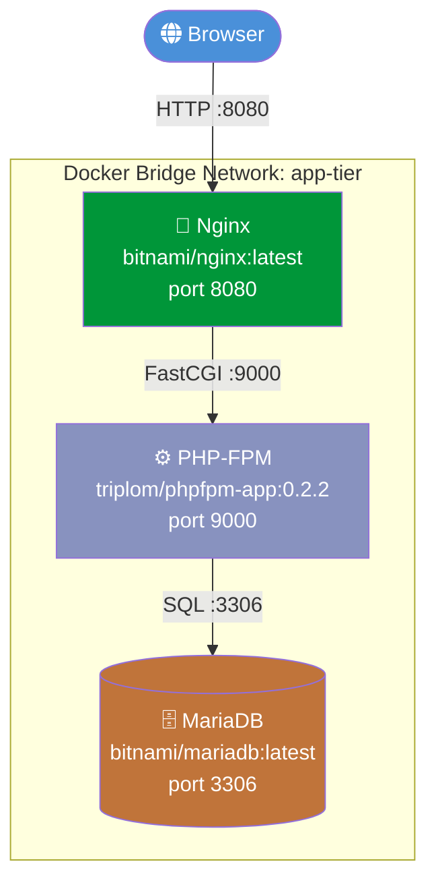
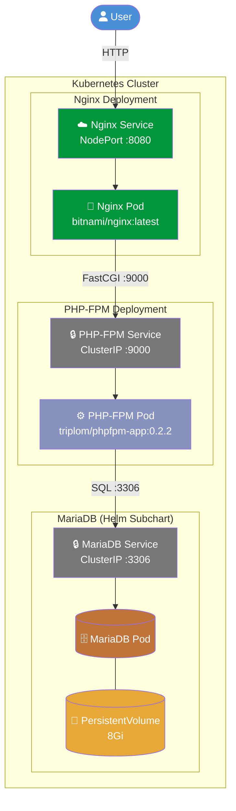
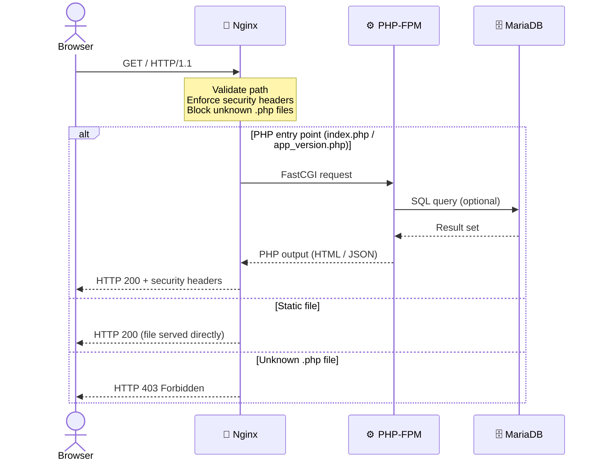
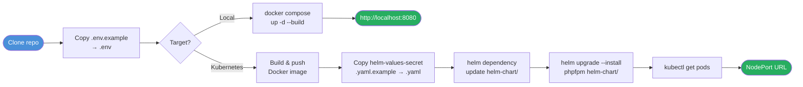

# PHP Application on Kubernetes with Helm

> A production-ready PHP-FPM application with Nginx reverse proxy and MariaDB database — containerised for local development with Docker Compose and deployable to Kubernetes via Helm 3.

---

## Table of Contents

1. [Overview](#overview)
2. [Architecture](#architecture)
   - [Local Development (Docker Compose)](#local-development-docker-compose)
   - [Kubernetes (Production)](#kubernetes-production)
   - [Request Flow](#request-flow)
3. [Project Layout](#project-layout)
4. [Prerequisites](#prerequisites)
5. [Getting Started](#getting-started)
6. [Local Development with Docker Compose](#local-development-with-docker-compose)
7. [Build and Push the Docker Image](#build-and-push-the-docker-image)
8. [Kubernetes Deployment with Helm](#kubernetes-deployment-with-helm)
9. [Application Endpoints](#application-endpoints)
10. [Configuration Reference](#configuration-reference)
11. [Security Overview](#security-overview)
12. [Troubleshooting](#troubleshooting)
13. [Clean Up](#clean-up)

---

## Overview

This project demonstrates a containerised PHP application stack with three components:

| Component | Image | Role |
|-----------|-------|------|
| **PHP-FPM** | `triplom/phpfpm-app:0.2.2` | Processes PHP scripts |
| **Nginx** | `bitnami/nginx:latest` | Reverse proxy, TLS termination, security headers |
| **MariaDB** | `bitnami/mariadb:latest` | Relational database |

The same application can be run **locally** with a single `docker compose up` command, or deployed to **any Kubernetes cluster** using the bundled Helm chart.

---

## Architecture

### Local Development (Docker Compose)

All three services run as separate containers on a private Docker bridge network (`app-tier`). Only the Nginx port is exposed to the host.



### Kubernetes (Production)

In Kubernetes each component runs in its own Deployment with a dedicated Service. PHP-FPM and MariaDB are never exposed outside the cluster — only Nginx is reachable via a NodePort (or Ingress).



> **Security note:** PHP-FPM (`ClusterIP`) and MariaDB (`ClusterIP`) are intentionally unreachable from outside the cluster. Only the Nginx `NodePort` service accepts external traffic.

### Request Flow

This sequence diagram shows the full lifecycle of an HTTP request through the stack.



### Deployment Workflow



---

## Project Layout

```
php-app-k8s-helm/
│
├── app/                              # PHP application source code
│   ├── index.php                     # Health-check endpoint → JSON
│   ├── app_version.php               # Version endpoint (reads APP_VERSION env)
│   └── server_blocks/
│       └── nginx.conf                # Nginx virtual host config
│
├── helm-chart/                       # Helm chart (Kubernetes deployment)
│   ├── Chart.yaml                    # Chart metadata + MariaDB dependency
│   ├── values.yaml                   # Default values (no secrets)
│   ├── helm-values-secret.yaml.example  # Template for secret overrides
│   ├── helm.sh                       # Convenience deploy script
│   └── templates/
│       ├── _helpers.tpl              # Template helpers (fullname, etc.)
│       ├── deployment.yaml           # PHP-FPM + Nginx Deployments
│       ├── service.yaml              # PHP-FPM ClusterIP Service
│       ├── nginx-service.yaml        # Nginx NodePort Service
│       ├── configMap.yaml            # Nginx config as ConfigMap
│       ├── secret.yaml               # Database credentials Secret
│       ├── ingress.yaml              # Optional Ingress resource
│       └── NOTES.txt                 # Post-install instructions
│
├── Dockerfile                        # PHP-FPM image (bitnami/php-fpm:8.2)
├── docker-compose.yml                # Local dev stack
├── .env.example                      # Environment variable template
├── .dockerignore                     # Docker build exclusions
└── .gitignore                        # Git exclusions (secrets, artifacts)
```

---

## Prerequisites

| Tool | Minimum version | Purpose |
|------|----------------|---------|
| [Docker](https://docs.docker.com/get-docker/) | 24.x | Build and run containers |
| [Docker Compose](https://docs.docker.com/compose/) | v2.x | Local multi-container stack |
| [kubectl](https://kubernetes.io/docs/tasks/tools/) | 1.25+ | Manage Kubernetes resources |
| [Helm](https://helm.sh/docs/intro/install/) | 3.x | Deploy and manage the Helm chart |
| Docker Hub account | — | Push your custom image |

> **Kubernetes cluster options:** [Minikube](https://minikube.sigs.k8s.io/), [kind](https://kind.sigs.k8s.io/), [k3s](https://k3s.io/), AKS, EKS, GKE, or any CNCF-conformant cluster.

---

## Getting Started

### 1. Clone the Repository

```bash
git clone https://github.com/triplom/php-app-k8s-helm.git
cd php-app-k8s-helm
```

### 2. Configure Environment Variables

```bash
cp .env.example .env
```

Open `.env` and replace the placeholder values with real credentials:

```dotenv
# .env — never commit this file
MARIADB_ROOT_PASSWORD=supersecret_root
MARIADB_USER=appuser
MARIADB_PASSWORD=supersecret_app
MARIADB_DATABASE=appdb
APP_VERSION=0.2.2
```

> `.env` is listed in `.gitignore` and will never be committed to version control.

---

## Local Development with Docker Compose

### Start the Stack

```bash
docker compose up -d --build
```

Docker Compose will:
1. Pull `bitnami/nginx:latest` and `bitnami/mariadb:latest`
2. Pull (or build) `triplom/phpfpm-app:0.2.2`
3. Start all three containers on the `app-tier` bridge network
4. Expose Nginx on **`http://localhost:8080`**

### Verify the Stack is Running

```bash
docker compose ps
```

Expected output:

```
NAME                         IMAGE                      STATUS
php-app-k8s-helm-nginx-1     bitnami/nginx:latest       Up
php-app-k8s-helm-phpfpm-1    triplom/phpfpm-app:0.2.2   Up
php-app-k8s-helm-mariadb-1   bitnami/mariadb:latest     Up
```

### Test the Endpoints

```bash
# Health check
curl http://localhost:8080/

# Application version
curl http://localhost:8080/app_version.php

# Confirm unknown PHP files are blocked (expect 403)
curl -o /dev/null -w "%{http_code}" http://localhost:8080/anything_else.php
```

### View Logs

```bash
# All services
docker compose logs -f

# Single service
docker compose logs -f nginx
docker compose logs -f phpfpm
docker compose logs -f mariadb
```

### Stop the Stack

```bash
docker compose down          # Stop and remove containers (data volume persists)
docker compose down -v       # Also remove the MariaDB data volume
```

---

## Build and Push the Docker Image

If you want to use your own image rather than `triplom/phpfpm-app:0.2.2`:

### Build

```bash
# Replace USERNAME with your Docker Hub username
docker build -t USERNAME/phpfpm-app:0.2.2 .
```

The `Dockerfile` is minimal and intentional:

```dockerfile
FROM bitnami/php-fpm:8.2       # pinned base image
COPY app /app                  # only app source — no test files, no secrets
WORKDIR /app
EXPOSE 9000
HEALTHCHECK ...                # validates PHP-FPM config on startup
```

### Push

```bash
docker login
docker push USERNAME/phpfpm-app:0.2.2
```

### Update values.yaml

Edit `helm-chart/values.yaml` to reference your image:

```yaml
image:
  repository: USERNAME/phpfpm-app
  tag: "0.2.2"
```

---

## Kubernetes Deployment with Helm

### 1. Verify Cluster Connectivity

```bash
kubectl cluster-info
kubectl get nodes
```

### 2. Add the Bitnami Helm Repository

The chart depends on the Bitnami `mariadb` subchart.

```bash
helm repo add bitnami https://charts.bitnami.com/bitnami
helm repo update
```

### 3. Fetch Chart Dependencies

```bash
helm dependency update helm-chart/
```

This downloads the MariaDB Helm subchart into `helm-chart/charts/`.

### 4. Configure Secret Values

```bash
cp helm-chart/helm-values-secret.yaml.example helm-chart/helm-values-secret.yaml
```

Edit the file and set real database passwords:

```yaml
# helm-chart/helm-values-secret.yaml  — NEVER commit this file
mariadb:
  auth:
    rootPassword: "supersecret_root"
    password:     "supersecret_app"
    username:     appuser
    database:     appdb
```

> This file is listed in `.gitignore` and excluded from version control.

### 5. Install or Upgrade the Chart

```bash
helm upgrade --install phpfpm helm-chart/ \
  --values helm-chart/helm-values-secret.yaml \
  --wait
```

| Flag | Purpose |
|------|---------|
| `upgrade --install` | Install on first run; upgrade on subsequent runs |
| `--values` | Merge secret overrides on top of `values.yaml` |
| `--wait` | Block until all Pods are Ready |

### 6. Verify the Deployment

```bash
# Check all pods are Running
kubectl get pods

# Check services
kubectl get svc

# Describe a pod if something is wrong
kubectl describe pod <pod-name>

# Stream logs
kubectl logs -f deployment/phpfpm-php-app-phpfpm
kubectl logs -f deployment/phpfpm-php-app-nginx
```

Expected pods:

```
NAME                                    READY   STATUS    RESTARTS
phpfpm-php-app-nginx-xxxx               1/1     Running   0
phpfpm-php-app-phpfpm-xxxx              1/1     Running   0
phpfpm-mariadb-0                        1/1     Running   0
```

### 7. Access the Application

**Minikube:**

```bash
minikube service phpfpm-php-app-nginx --url
```

**Other clusters (NodePort):**

```bash
export NODE_PORT=$(kubectl get svc phpfpm-php-app-nginx \
  -o jsonpath="{.spec.ports[0].nodePort}")
export NODE_IP=$(kubectl get nodes \
  -o jsonpath="{.items[0].status.addresses[0].address}")
echo "http://$NODE_IP:$NODE_PORT"
```

**With Ingress (optional):**

Enable in `values.yaml`:

```yaml
ingress:
  enabled: true
  hosts:
    - your-domain.example.com
```

---

## Application Endpoints

| Endpoint | Method | Description | Expected response |
|----------|--------|-------------|------------------|
| `/` | GET | Health check | `{"status":"ok","service":"php-app"}` |
| `/app_version.php` | GET | Application version | HTML page with version string |
| `/*.php` (any other) | GET | Blocked by Nginx | `403 Forbidden` |

---

## Configuration Reference

All configurable values are in `helm-chart/values.yaml`. Secret values should **always** be passed via a separate file or `--set` — never stored in `values.yaml`.

| Key | Default | Description |
|-----|---------|-------------|
| `replicaCount` | `1` | Number of PHP-FPM and Nginx replicas |
| `image.repository` | `triplom/phpfpm-app` | PHP-FPM image repository |
| `image.tag` | `0.2.2` | PHP-FPM image tag |
| `image.pullPolicy` | `IfNotPresent` | Image pull policy |
| `nginxImage.repository` | `bitnami/nginx` | Nginx image repository |
| `nginxImage.tag` | `latest` | Nginx image tag |
| `nginxService.type` | `NodePort` | Nginx service type |
| `nginxService.externalPort` | `8080` | External port |
| `phpfpmService.type` | `ClusterIP` | PHP-FPM service type (internal only) |
| `phpfpmService.phpfpmPort` | `9000` | PHP-FPM listen port |
| `ingress.enabled` | `false` | Enable Ingress resource |
| `resources.limits.cpu` | `200m` | PHP-FPM CPU limit |
| `resources.limits.memory` | `256Mi` | PHP-FPM memory limit |
| `nginxResources.limits.cpu` | `100m` | Nginx CPU limit |
| `nginxResources.limits.memory` | `128Mi` | Nginx memory limit |
| `mariadb.enabled` | `true` | Deploy MariaDB subchart |
| `mariadb.auth.database` | `appdb` | Database name |
| `mariadb.auth.username` | `appuser` | Database user |
| `mariadb.primary.persistence.size` | `8Gi` | MariaDB PVC size |

---

## Security Overview

This project applies defence-in-depth at every layer.

### Network Isolation

```
Internet
  │
  ▼
Nginx (NodePort / Ingress)   ← only entry point
  │
  │  FastCGI (internal)
  ▼
PHP-FPM (ClusterIP)          ← unreachable from outside cluster
  │
  │  SQL (internal)
  ▼
MariaDB (ClusterIP)          ← unreachable from outside cluster
```

### Nginx Security Headers

All responses include the following headers:

| Header | Value | Purpose |
|--------|-------|---------|
| `X-Frame-Options` | `SAMEORIGIN` | Prevent clickjacking |
| `X-Content-Type-Options` | `nosniff` | Prevent MIME sniffing |
| `X-XSS-Protection` | `1; mode=block` | Legacy XSS filter |
| `Referrer-Policy` | `strict-origin-when-cross-origin` | Limit referrer leakage |
| `Content-Security-Policy` | `default-src 'self'` | Restrict resource origins |
| `server_tokens` | `off` | Hide Nginx version |

### PHP File Execution Whitelist

Only two PHP files are permitted to execute — all others return `403 Forbidden`:

```nginx
location = /index.php      { fastcgi_pass phpfpm:9000; ... }
location = /app_version.php { fastcgi_pass phpfpm:9000; ... }
location ~ \.php$           { return 403; }   # catch-all deny
```

### Container Security Context (Kubernetes)

Both the PHP-FPM and Nginx pods run with hardened security contexts:

```yaml
securityContext:
  runAsNonRoot: true
  runAsUser: 1001
  allowPrivilegeEscalation: false
  capabilities:
    drop: [ALL]
```

### Secrets Management

| Layer | Method |
|-------|--------|
| Local dev | `.env` file (gitignored) |
| Kubernetes | `helm-values-secret.yaml` (gitignored) merged at deploy time |
| Kubernetes runtime | Stored as a `Secret` resource in the cluster |

---

## Troubleshooting

### Container exits immediately

```bash
docker compose logs phpfpm   # Check for PHP-FPM config errors
docker compose logs nginx    # Check for Nginx config errors
```

### `bitnami/nginx:1.25: not found`

Bitnami removed versioned tags from Docker Hub. Use `latest`:

```bash
# In docker-compose.yml or values.yaml
image: bitnami/nginx:latest
```

### `.env not found`

```bash
cp .env.example .env
# Then edit .env with your credentials
```

### Pod stuck in `Pending`

```bash
kubectl describe pod <pod-name>
# Common causes: insufficient resources, missing PVC, image pull failure
```

### Pod stuck in `CrashLoopBackOff`

```bash
kubectl logs <pod-name> --previous
# Check MARIADB_* env vars and database connectivity
```

### Helm dependency error

```bash
helm dependency update helm-chart/
# Re-run if charts/ directory is missing or outdated
```

### Port 8080 already in use (local)

```bash
# Find what is using it
sudo ss -tlnp | grep 8080
# or change the port in docker-compose.yml
ports:
  - '8081:8080'
```

---

## Clean Up

### Docker Compose

```bash
docker compose down        # Stop containers (keep volumes)
docker compose down -v     # Stop containers and delete MariaDB data volume
```

### Kubernetes

```bash
helm uninstall phpfpm                          # Remove all Helm-managed resources
kubectl delete pvc -l app.kubernetes.io/instance=phpfpm   # Remove data volumes
```

---

## Contributing

1. Fork the repository
2. Create a feature branch: `git checkout -b feature/my-change`
3. Commit your changes: `git commit -m 'feat: describe the change'`
4. Push: `git push origin feature/my-change`
5. Open a pull request

---

*Chart version: `0.2.0` · App version: `0.2.2` · PHP: `8.2` · MariaDB: `>=11.0 <12.0`*
